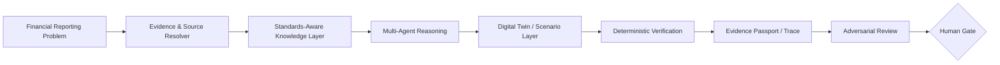

# IFRS-AI Inspector

**Standards-aware multi-agent digital-twin research for verifiable financial reporting and assurance.**

[](#maturity-and-use-boundary)
[](#governance-and-assurance-boundary)
[](./CITATION.cff)
[](https://github.com/Saehon/Saeid-Homayoun)

**Principal investigator:** Saeid Homayoun  
**ORCID:** https://orcid.org/0000-0002-2536-0446  
**Research portfolio:** NAAIL OpenLab  
**Status:** Public research prototype · pre-production · human-review-required

> **Independent research project.** References to the IFRS Foundation, PCAOB, IAASB, ISSB, ESRS, COSO, Google, Microsoft, OpenAI, audit firms, or other organizations identify standards, public research, technologies, or comparison targets only. They do not imply affiliation, endorsement, certification, sponsorship, or regulatory approval.

---

## What this repository is

**IFRS-AI Inspector** is a research framework for studying how multi-agent AI, knowledge graphs, retrieval, deterministic verification, and accounting digital twins can support standards-aware financial-reporting and assurance tasks.

The design principle is simple:

> **AI may retrieve, classify, reason, and explain; material calculations, evidence provenance, control checks, and professional conclusions must remain verifiable and subject to human approval.**

The project is intended for research, education, prototyping, and reproducible experimentation. It is not an audit opinion, accounting advice, legal advice, regulatory guidance, or a production accounting system.

---

## Architecture



### 1. Standards-aware knowledge layer

The stable layer organizes accounting and assurance concepts, evidence provenance, source hierarchy, accounting judgments, reporting assertions, and structured links to authoritative or appropriately licensed professional materials.

### 2. Replaceable technology layer

Models, agent frameworks, retrieval systems, embeddings, graph technologies, and orchestration components are treated as replaceable. The architecture should remain usable as technology changes.

### 3. Deterministic verification layer

Where a conclusion depends on arithmetic, reconciliations, accounting identities, XBRL consistency, threshold logic, or other deterministic checks, those tests should be implemented independently from generative-model narration.

---

## Core research questions

The repository supports research on questions such as:

- Can a standards-aware agent retrieve the correct evidence before forming a conclusion?
- Can professional judgments be represented as transparent decision graphs rather than opaque prompts?
- Does deterministic verification reduce materially incorrect AI-generated accounting conclusions?
- Can digital twins support controlled testing of alternative accounting treatments and audit responses?
- Can evidence provenance, contradiction detection, abstention, and human escalation improve professional reliability?

---

## Current repository map

```text
IFRS-AI-Inspector/
├── README.md
├── CITATION.cff
├── RESEARCH_PROTOCOL.md
├── EXTERNAL_INTEGRATIONS.md
├── POMELO_INTEGRATION.md
├── IP_PATENT_READINESS.md
├── ROADMAP.md
├── SECURITY.md
├── CONTRIBUTING.md
├── config/
├── docs/
├── src/
├── tests/
└── pomelo.yaml
```

Important starting points:

- [`docs/`](./docs/) — architecture, ontology, data-engineering and research documentation;
- [`src/`](./src/) — prototype implementation modules;
- [`RESEARCH_PROTOCOL.md`](./RESEARCH_PROTOCOL.md) — evidence and scientific-governance requirements;
- [`POMELO_INTEGRATION.md`](./POMELO_INTEGRATION.md) — integration boundary with the private POMELO research platform;
- [`EXTERNAL_INTEGRATIONS.md`](./EXTERNAL_INTEGRATIONS.md) — external technology and interoperability notes.

---

## Research workflow

**Research Question → Literature / Standards Validation → Evidence Retrieval → Competing Interpretations → Digital-Twin Test → Deterministic Verification → Adversarial Review → Robustness / Falsification → Reproducibility → Human Gate**

Research invariants:

```text
model_confidence_is_professional_evidence = false
agent_consensus_is_authority = false
human_gate_required = true
production_use_assumed = false
unsupported_compliance_claims_allowed = false
```

---

## Evaluation targets

A professional-grade evaluation should assess more than answer accuracy. Candidate dimensions include:

| Dimension | Example question |
|---|---|
| Evidence retrieval | Did the system identify the relevant source and version? |
| Authority / scope | Is the cited authority applicable to the issue being analyzed? |
| Provenance | Can each material conclusion be traced to evidence? |
| Calculation reproducibility | Can numerical outputs be independently recomputed? |
| Contradiction detection | Did the system surface conflicting evidence or interpretations? |
| Calibration | Does confidence track observed correctness? |
| Abstention / escalation | Does the system stop when evidence is insufficient? |
| Robustness | Does the conclusion survive reasonable alternative assumptions? |
| Reproducibility | Can another researcher reproduce the run? |
| Human approval | Was the final professional judgment explicitly reviewed? |

---

## IFRS 15 demonstration domain

IFRS 15 is used as an illustrative research domain for testing revenue-recognition reasoning, performance-obligation mapping, transaction-price logic, evidence retrieval, scenario analysis, and deterministic reconciliation.

This use is for research and demonstration. The repository does not reproduce or redistribute restricted standards text and does not claim IFRS Foundation certification.

---

## EU AI Act and governance considerations

The project incorporates **EU AI Act-aware design considerations** such as traceability, data governance, human oversight, documentation, risk controls, and reproducibility.

**This is not a legal determination or compliance certification.** Whether a real deployment falls within a regulated category, and what obligations apply, depends on the specific system, role, use case, jurisdiction, and implementation. Formal deployment requires appropriate legal, security, privacy, model-risk, professional, and regulatory review.

---

## Maturity and use boundary

Current status: **research prototype / pre-production**.

Do not represent repository outputs as:

- an audit opinion;
- an IFRS Foundation or regulator-approved interpretation;
- a validated production assurance system;
- legal or regulatory advice;
- evidence of compliance merely because a local test passes.

Stronger claims require stronger evidence: documented evaluation, holdout testing, reproducibility, security review, independent review, and qualified human approval.

---

## Licensing and third-party rights

The repository currently contains **MIT** and **Apache-2.0** licensing materials. Where project files are offered under a dual-license arrangement, they should be interpreted as **MIT OR Apache-2.0**, subject to file-specific notices. Those licenses permit commercial use; previously granted open-source rights cannot be retroactively converted into a non-commercial restriction for already distributed copies.

Third-party standards, datasets, trademarks, models, services, and software remain subject to their own rights and terms. Future patent-sensitive, proprietary, or research-only NAAIL modules should be kept clearly separated from permissively licensed public code before release.

---

## Citation

Use [`CITATION.cff`](./CITATION.cff). Suggested citation:

> Homayoun, S. (2026). *IFRS-AI Inspector: Standards-Aware Multi-Agent Digital-Twin Research for Verifiable Financial Reporting and Assurance* [Research software]. GitHub. https://github.com/Saehon/IFRS-AI-Inspector

---

## Related NAAIL research products

- **NAAIL OpenLab / ECONOVA-S™** — research co-scientist and reproducible empirical discovery hub;
- **AAA — Audit & Accounting AI Laboratory** — public audit/accounting experimentation;
- **POMELO™ / POMELO VERA™** — private professional-intelligence, verification, evaluation, and governance platform;
- **PCAOB Inspection Agent** — private inspection-research prototype;
- **Multi-Agent Accounting AI Framework** — public BERT/agent/digital-twin experimentation.

Portfolio hub: https://github.com/Saehon/Saeid-Homayoun
