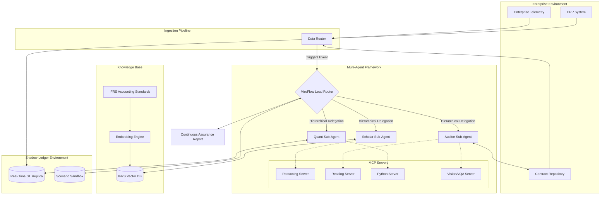

# IFRS-AI Inspector: Phase 2 - Architectural Design

Building upon our established ontology (Phase 1), we now translate those concepts into a robust system architecture. This blueprint defines how the components interact to achieve autonomous continuous assurance.

## 2.1 System Architecture Diagram

The core orchestration is handled by **MiroFlow**, leveraging the **MiroThinker** model for tool-assisted reasoning. The framework operates on a hierarchical sub-agent orchestration model where a lead router agent delegates tasks to specialized sub-agents. These agents interact with the **Shadow Ledger** (the Digital Twin) and the **IFRS Knowledge Base** (RAG) using standardized **MCP (Model Context Protocol) Servers**.

## 2.2 Data Ingestion Architecture

The ingestion pipeline must convert raw enterprise data into a format suitable for the Shadow Ledger and agent consumption.

1.  **Event Capture**: Listeners are attached to the ERP (e.g., via webhooks or change data capture [CDC]) to capture new transactions in real-time.
2.  **Document Parsing**: When a transaction is linked to a contract (e.g., a new lease), the contract is routed through OCR and unstructured parsing services to extract key terms (duration, payment terms, discount rates).
3.  **Normalization**: All data is mapped to the standard **IFRS Assurance Ontology** defined in Phase 1 before being written to the Shadow Ledger.

## 2.3 RAG System Architecture for IFRS Standards

To ensure agents have up-to-date and accurate accounting knowledge, we implement a Retrieval-Augmented Generation (RAG) system.

*   **Corpus**: The full text of IFRS standards (IFRS 1 through 17, IAS 1 through 41, IFRIC interpretations), plus public accounting firm guidance.
*   **Chunking Strategy**: Semantic chunking based on document structure (e.g., standard -> section -> paragraph). Each paragraph (e.g., IFRS 15, paragraph 31) acts as a distinct knowledge node.
*   **Vectorization**: Using a high-dimensional embedding model optimized for financial and legal text.
*   **Retrieval**: When the *IFRS Technical Accounting Expert* agent encounters an event, it queries the vector database using a semantic representation of the event (e.g., "Customer pays in advance for a two-year software subscription"). The database returns the most relevant IFRS paragraphs (e.g., IFRS 15 guidance on contract liabilities) for the agent to reason over.

---
*End of Phase 2 Blueprint.*
